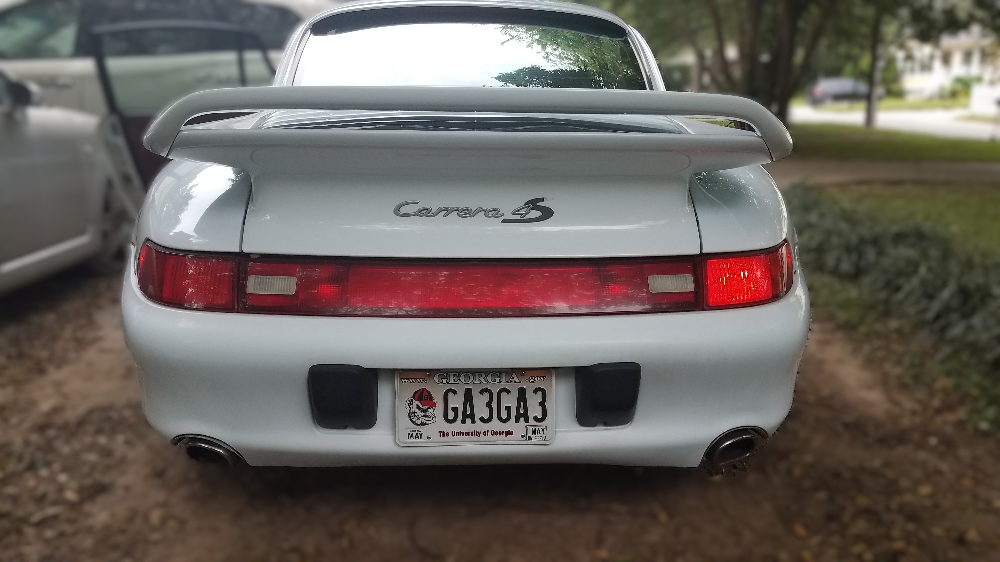

# 1997 Porsche 911 Carrera 4S (993)



## Overview
This repository showcases a meticulously maintained 1997 Porsche 911 Carrera 4S (993), the last of the air-cooled 911s. This vehicle represents a significant piece of automotive history, combining classic Porsche engineering with modern performance.

## Vehicle Highlights
- **Model**: 1997 Porsche 911 Carrera 4S (993)
- **Engine**: 3.6L Flat-6 (M64/21)
- **Horsepower**: 282 HP @ 6,100 RPM
- **Transmission**: 6-speed manual
- **Mileage**: Approximately 135,000 miles
- **Exterior**: Arctic Silver
- **Interior**: Black leather
- **Special Features**: All-wheel drive, widebody design, rear spoiler

## Project Details
This website serves as a digital showcase for this rare and collectible vehicle, featuring:

### Key Sections
- **Gallery**: High-resolution images of the vehicle's exterior, interior, and details
- **Specifications**: Detailed technical specifications and performance data
- **History**: The story of the 993 generation and this specific vehicle
- **Rarity**: Information about production numbers and collector value
- **Contact**: Inquiries about the vehicle

## Technical Stack
- **Frontend**: HTML5, CSS3, JavaScript (Vanilla)
- **Styling**: Custom CSS with CSS Variables
- **Icons**: Font Awesome 6.0
- **Fonts**: Google Fonts (Montserrat, Playfair Display)
- **Responsive Design**: Mobile-first approach with media queries

## Features
- Interactive image gallery with lightbox functionality
- Responsive design for all device sizes
- Contact form with email preview
- PDF viewer for vehicle documentation
- Smooth scrolling navigation
- Performance-optimized assets

## Getting Started
To view this project locally:

1. Clone the repository:
   ```bash
   git clone https://github.com/DWSMITHJR/993.git
   ```

2. Open `index.html` in your preferred web browser

## Vehicle Documentation
- Complete service history available upon request
- Original window sticker included
- Clean title in hand

## Contact Information
- **Owner**: Donald Woodson Smith
- **Location**: Atlanta, GA 30318
- **Phone**: (404) 939-3663
- **Email**: phdproton@pm.me

## License
All content and images are property of the vehicle owner. Unauthorized use or reproduction is prohibited.

## Disclaimer
This vehicle is presented as-is. All specifications are believed to be accurate but are not guaranteed.
